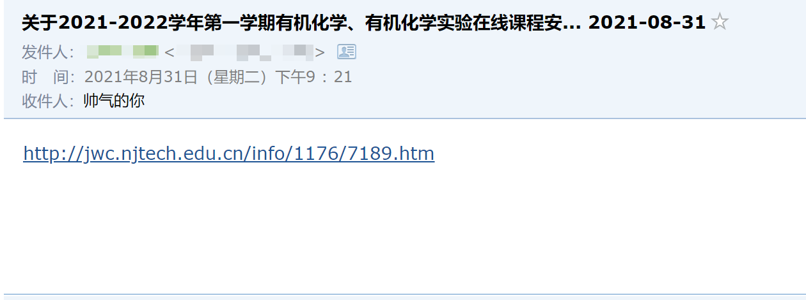

# 南京工业大学教务处通知邮件发送脚本

本脚本用于自动爬取教务处最新消息，并发送通知链接至邮箱

可将脚本放于服务器，每小时运行一次，用于检测最新通知

## 脚本效果

## 环境配置

- Python3

- bs4

- requests

- smtplib

- 开通qq邮箱smtp服务，并获取授权码

### 安装

`pip3 install beautifulsoup4`

`pip3 install requests`

## 脚本配置

- **修改`update.txt`**

  将文本内通知号改为最新通知号，脚本将自动发送大于当前通知号的通知

  通知号为教务处通知网址的最后四位数字

  例如通知：http://jwc.njtech.edu.cn/info/1175/7185.htm

  则通知号为`7185`

- **修改 `mail_user` `sender` `message['From']` `mail_pass` （邮箱smtp服务开通，以及qq邮箱授权码获取方式请自行百度）**

  将代码中的`youremail@qq.com` 改为自己的发件邮箱,`授权码`改为自己的授权码

  发件邮箱：`mail_user="youremail@qq.com"` 

  ​				   `sender = '教务处邮件提醒服务<youremail@qq.com>'` 

  ​                   `message['From'] = '"=?gb18030?B?vczO8bSm08q8/szh0NG3/s7x?="<youremail@qq.com>'`
  
  授权码：`mail_pass="授权码" `

- **修改收件人邮箱`receivers = ['收件人邮箱']`**

  如：`receivers = ['zhangsan@qq.com','123456789@qq.com','lisi@outlook.com']`
